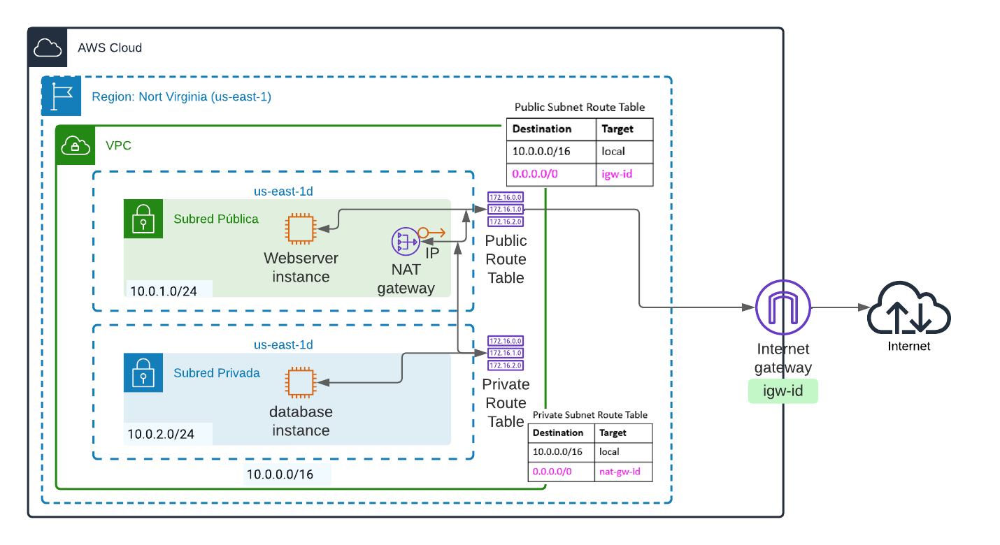

# Tarea: Redes y Máquinas Virtuales


## Descripción

### VPC 
Crear una red virtual (VPC) con una subred pública y otra privada, siguiendo el diagrama que muestra la figura:



Los pasos serían:

1.- Crear la VPC

2.- Crear la subred pública

3.- Crear la subred privada

4.- Crear un Internet Gateway y asociarlo a la VPC

5.- Modificar la tabla de rutas de la subred pública añadiendo una ruta al Internet Gateway

6.- Crear un NAT Gateway en la red pública, asociándole una IP elástica

7.- Modificar la tabla de rutas de la subred privada añadiendo una ruta al NAT Gateway

### Máquinas Virtuales

#### Instancia Webserver

Crear una instancia en la red pública, con un Segurity Group habilitando el puerto 22 para una IP específica y el puerto 80 para todas las peticiones. Instalar Apache con PHP.

Los pasos:

1.- Crear la Instancia

2.- Instalar Apache

```
$ sudo apt update
$ sudo apt install apache2
```

Para comprobar que está funcionando el servidor web:

```
$ sudo systemctl status apache2
...
Active: active (running)
...
```

Ahora podrás acceder, desde un navegador, a la página por defecto con:

```
http://IP_MAQUINA
```
Para gestionar el servicio de apache:

```
Parar
$ sudo systemctl stop apache2
Iniciar
$ sudo systemctl start apache2
Reiniciar
$ sudo systemctl restart apache2
Recargar configuración
$ sudo systemctl reload apache2
Iniciar en el arranque
$ sudo systemctl enable apache2
No iniciar en el arranque
$ sudo systemctl disable apache2
```


3.- Instalar PHP

```
sudo apt install php libapache2-mod-php php-mysql
``` 


#### Instancia Database

Crear una instancia en la red privada, con un Segurity Group habilitando el puerto 22 y el 3306 para la IP interna de la máquina Webserver. Instalar MySQL, crear un nuevo usuario, una base de datos, otrogar permisos al usuario a esa base de datos y permitir el acceso remoto al servidor MySQL.

Pasos:

1.- Crear la Instancia

2.- Instalar MySQL Server

```
$ sudo apt update
$ sudo apt install mysql-server
```

Ejecuta el script para realizar una instalación segura:

```
$ sudo mysql_secure_installation
```
(completa el script con las respuestas deseadas)

Accede, por primera vez, de forma local como root:

```
$ sudo mysql
mysql>
```

Asigna una password al usuario root:

```
mysql> ALTER USER 'root'@'localhost' IDENTIFIED WITH mysql_native_password BY 'password';
mysql> exit
$ mysql -u root -p
password: _
```

Crear un usuario MySQL con el comando:
```
CREATE USER 'username'@'host' IDENTIFIED WITH authentication_plugin BY 'password';
```
Por ejemplo:

```
mysql> CREATE USER 'userweb'@'IP_WebServer' IDENTIFIED WITH authentication_plugin BY 'P4ssW*rd';
```

Crear la Base de datos (pruebaDB):

```
mysql> show databases;
mysql> create database pruebaDB;
mysql> use pruebaDB;
mysql> show tables;
```
Asignar permisos al usuario en la base de datos con:
```
GRANT privileges ON database.table TO 'username'@'host';
```
Por ejemplo:
```
mysql> GRANT ALL PRIVILEGE ON pruebaDB.* TO 'userweb'@'IP_WebServer' WITH GRANT OPTION;
mysql> FLUSH PRIVILEGES;
```
Cambia la configuración en el fichero /etc/mysql/mysql.conf.d/mysqld.cnf modificando la directiva bind-address

```
# Comenta la línea:
# bind-address = localhost
# y añade:
bind-address = 0.0.0.0
```

Reinicia el servicio:

```
$ sudo systemctl restart mysql
```
Ahora, podrías acceder desde la máquima Webserver a MySQL. Para comprobarlo, puedes instalar el cliente MySQL en WebServer:

```
$ sudo apt update
$ sudo apt install mysql-client
```
Y ejecutar el siguiente comando:

```
$ mysql -u userweb -h IP_Database -p
Password: _

...

mysql> _
```

### PHP App para conectar a la BD

En WebServer, crear el fichero index.php en el directorio /var/www/html. Por ejemplo, con:

```
$ sudo nano /var/www/html/index.php
```
Incluye el siguiente contenido:
```php
<?php
// Nunca expongas tus claves en el código fuente
// declara variables de entorno con los valores adecuados
$servername = $_ENV["HOST"] ;
$username = $_ENV["USER"] ;
$password = $_ENV["PASS"] ;
// Nunca expongas tus claves en el código fuente


// Create connection
$conn = new mysqli($servername, $username, $password);

// Check connection
if ($conn->connect_error) {
  die("Connection failed: " . $conn->connect_error);
}
echo "Connected successfully";
?>
```

Ahora podrías acceder, desde un navegador, a:

```
http://IP_MAQUINA/index.php
```
